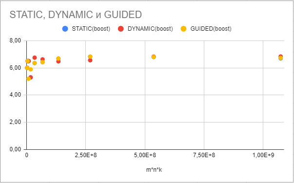
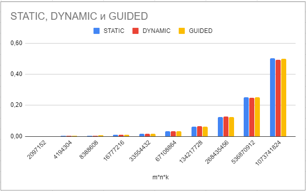

# itmo-master-1-multithreading-programming
Repository for "Multithreading Programming" ITMO master course

# Лабораторная работа №1
## Постановка задачи
Реализовать программу по вычислению произведения матриц с использованием
OpenMP. Исследовать эффективность распаралеливания и ускорения вычислений в
зависимости от способов распаралеливания.
В качестве аргументов приложения должно принимать два файла с матрицами
формата:
```
m n
x11 x12 x13
x21 x22 x21
x31 x32 x33
```
A[m * n] * B[n * k] = C[m * k]
## Решение
### Последовательное решение
```Cpp
for (int rowIdx = 0; rowIdx < rows; ++rowIdx) {
    for (int columnIdx = 0; columnIdx < columns; ++columnIdx) {
        int element = 0;
        for (int i = 0; i < n; ++i) {
            element += A[rowIdx][i] * B[i][columnIdx];
        }
        C[rowIdx][columnIdx] = element;
    }
}
```
### Оптимизированное последовательное решение
Приведеное выше решение обладает недостатком, который заключается в том, 
что доступ к элементам матрицы B производится непоследовательно.
Это приводит к промохам в кэше CPU. Этот недостаток легко утстранить
организуя последовательный доступ к элементам всех матриц во внутренем цикле.
```Cpp
for (int rowIdx = 0; rowIdx < rows; ++rowIdx) {
    int *row = C[rowIdx];
    for (int i = 0; i < n; ++i) {
        int element = A[rowIdx][i];
        for (int columnIdx = 0; columnIdx < columns; ++columnIdx) {
            row[columnIdx] += element * B[i][columnIdx];
        }
    }
}
```
### Параллельное решение
Описаннные выше алгоритмы можно распараллелить. Запись происходит только в матрицу C, причем внешний цикл в последовательном алгориме
по очереди перебирает каждую строку. 
Мы можем распараллелить формирования строк результата между отдельными потоками.
Каждый поток получит эксклюзивный доступ 
на запись в строку результирующей матрицы, значения которой он расчитывает, 
что позволит избежать накладных расходов на синхронизацию результатов.
Мы можем добиться этого распараллелив внешний цикл for с помощью директивы OpenMP
```
#pragma omp parallel for schedule(scheduling-type)
```
OpenMP предоставляет несколько подходов для планирования заданий между потоками (scheduling-type):
- Static - равными частями по очереди
- Dynamic - равными частями по запросу потока
- Guided - разными частями по запросу потока
Static в теории должен обладать меньшими накладными расходами, посколько порядок выполнения заданий строго детерминирован,
в отличии от Dynamic и Guided. Однако, Dynamic и Guided будут показывать лучшее среднее время работы если объем выполняемых действий
сильно варьируется. В случае перемножения матриц, объем работы на каждой итерации одинаков, поэтому Guided и Dynamic не дадут никакого прироста.

## Реализация
### Перемножатель матриц
[openmp](./openmp)
Описание аргументов:
```
At least 3 arguments must be specified:
  1. First matrix file path
  2. Second matrix file path
  3. Result matrix file path
Optional arguments:
  4. Number of retries to measure min evaluation time (default 5)
  5. OpenMP schedule type. Available values are [NONE, STATIC, DYNAMIC, GUIDED] (default STATIC). NONE means sequential execution, openmp is not involved
If schedule type in not NONE, the following parameter can be specified:
  6. OpenMP chunk size. -1 - omp decides itself. (default -1)
```
### Утилита для сбора статистики в csv файл
[openmp-benchmark](./openmp-benchmark)

Описание аргументов:
```
Please, specify program arguments:
  1. first matrix file path
  2. second matrix file path
  3. result matrix file path
  4. multiplier executable file path
  4. output stats csv file path
```
## Измерение времени
Для получения наиболее точных результатов каждый эксперимент повторялся несколько раз, затем бралось минимальное значение,
чтобы минимизировать влияние других процессов ОС на результаты эксперимента.

## Технические характеристики машины
Процесор AMD Ryzen 5 2600 Six-Core Processor 3.40 GHz
Операционная система Windows 10 64 bit
Распараллеленная версия позволила получить 6-ти кратное увеличение производительности и полную утилизацию CPU. 
Разницы между различными типами планировщиков при решении данной задачи не было выявлено. 

## Результаты
|m * n * k|Sequential(ms)|STATIC(ms)|DYNAMIC(ms)|GUIDED(ms)|STATIC(boost)|DYNAMIC(boost)|GUIDED(boost)|
|:-------:|:------------:|:--------:|:---------:|:--------:|:-----------:|:------------:|:-----------:|
|2097152|0,01|0,00|0,00|0,00|6,00|6,01|6,00|
|4194304|0,01|0,00|0,00|0,00|6,50|6,50|6,50|
|8388608|0,03|0,00|0,00|0,01|6,50|6,50|5,20|
|16777216|0,05|0,01|0,01|0,01|5,30|5,30|5,89|
|33554432|0,11|0,02|0,02|0,02|6,35|6,75|6,35|
|67108864|0,21|0,03|0,03|0,03|6,42|6,62|6,42|
|134217728|0,42|0,06|0,07|0,06|6,68|6,48|6,68|
|268435456|0,85|0,12|0,13|0,12|6,82|6,56|6,82|
|536870912|1,70|0,25|0,25|0,25|6,80|6,83|6,80|
|1073741824|3,36|0,50|0,49|0,50|6,70|6,83|6,73|

### Ускорение

### Сравнение OpenMP планировщиков

