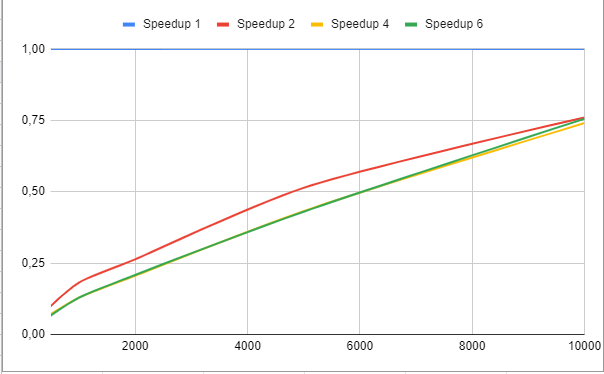
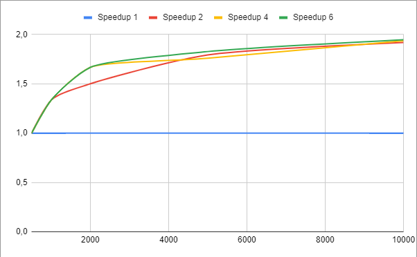
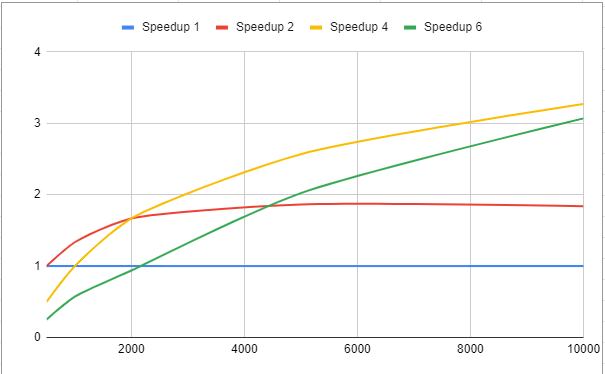

# Лабораторная работа No4
## Цель
Реализация параллельный алгоритм Дейкстры.

## Задача
Разработать и реализовать параллельный алгоритм поиска кратчайшего пути
из одной вершины до всех других в взвешенном графе, без ребер отрицательного
веса, с помощью алгоритма Дейкстры. Построить график зависимостей от времени
работы алгоритма в зависимости от количества используемых потоков (процессов). В
качестве технологии реализация может быть выбрана любая из рассмотренных в
рамках курса (OpenMP, MPI, реализация потоков на языках C++, C#, Java)

## Входные данные
1. Имя файла, хранящего матрицу смежности для графа
2. Номер исходной вершины.
3. Имя файла для записи результата поиска. Через пробел записаны числа типа
int, расстояние до вершины с соответствующим номером (согласно матрице). В
случае если вершина недостижима - INF

## Установка
### Необходимое программное обеспечение
Необходимо установить JDK8 и maven

Сборка
```bash
git clone https://github.com/AlexIvchenko/itmo-master-1-parallel-programming.git
cd itmo-master-1-parallel-programming/dijkstra
mvn clean install
```
## Запуск алгоритма
Unix
```
./bin/run.sh dikstra --help
```
Windows
```
bin\run.bat dikstra --help
```
```
Usage: <main class> dijkstra [-hV] --input=<inputFile> [--mode=<mode>]
                             --output=<outputFile> [--start=<startNode>]
  -h, --help                Show this help message and exit.
      --input=<inputFile>   input file with numbers to sort
      --mode=<mode>         format of output statistics, valid values:
                              SEQUENTIAL, PARALLEL_SHORT_2, PARALLEL_SHORT_4,
                              PARALLEL_SHORT_6, PARALLEL_LONG_PHASER_2,
                              PARALLEL_LONG_PHASER_4, PARALLEL_LONG_PHASER_6,
                              PARALLEL_LONG_BARRIER_PER_ITERATION_2,
                              PARALLEL_LONG_BARRIER_PER_ITERATION_4,
                              PARALLEL_LONG_BARRIER_PER_ITERATION_6
      --output=<outputFile> output file for sorted numbers
      --start=<startNode>   number of start node
  -V, --version             Print version information and exit.
```
## Запуск бенчмарков (jmh)
Unix
```
./bin/run.sh jmh
```
Windows
```
bin\run.bat jmh
```

## Анализ
Алгоритм Дейкстры состоит из двух частей:
1. Выбор вершины, не принадлежащей кластеру, до которой минимальное расстояние из кластера (далее будем называть эту стадию **поиск минимума**)
2. Добавление найденной вершины в кластер и обновление расстояний до всех остальных вершин вне кластера (далее будем называть эту стадию **релаксация**)

Его можно распараллелить следующим образом
1. Разбиваем все множество вершин на `p` процессов,
таким образом каждый процесс будет работать с вершинами `[offset, offset + jobSize)`
2. Поиск локального минимума на каждом процессоре (**параллельный код**)
3. Стадия синхронизации - выбор глобального минимума (**последовательный код**)
4. Релаксация с найденным минимумом на каждом процессоре (**параллельный код**)


### Графовые структуры
Для данной задачи была использована минимальная реализация графа с константым доступом до веса ребра 
по стартовой и конечной вершинам.
Для рандомных матриц с неотрицательными весами была использована матрица смежности на базе `int[][]`
Для больших матриц, которые не помещаются в память, были использованы генерируемые матрицы.
В генерируемых матрицах значение веса ребра является функцией от номеров стартовой и конечной вершин,
например, модуль или квадрат разности.

Поскольку доступ к весам графа это крайне быстрые операции: доступ к элементу массива, вычитание двух int и т.д.,
и как следствие операции поиска минимума и релаксации выполняются очень быстро даже для большого количества вершин,
то расспараллеливание такого кода с приемленным ускорением и эффективностью является нетривиальной задачей.
Поскольку, несмотря на то, что объем параллельного кода большой, он разделен на очень маленькие и быстрые части
(такие как поиск минимума и релаксация), которые чередуются с последовательным кодом.

### Подходы
#### Short Task
1. На каждой итерации запускаются задач для поиска локального минимума
2. Ожидание завершения запущенных задач
3. Поиск глобального минимума
4. Запуск задач на локальную релаксацию
5. Ожидание завершения запущенных задач

##### Результаты


Был получен очень большой оверхед на синхронизацию.
Изначальная реализация создавала свежие таски на каждой итерации, но это показывало
слишком большой оверхед при профилировании. После этого было принято решение
не пересоздавать таски, а переинициализировать существующие. Это увеличило производительность,
но добиться соизмеримого времени по сравнению с последовательным алгоритмом получилось
только на очень больших графах.

Причины:
* Очень маленькие задачи, которые выполняются крайне быстро
* Суммарное время таких задач в рамках алгоритма велико, однако на каждой итерации
каждая задача занимает от несколько микросекунд до нескольких миллисекунд
* Много работы по добавлению / извлечению задач из очереди, а также на инициализацию этих задач

#### Long Task
1. Внешний цикл алгоритма размещается в каждом процессоре (воркере)
2. Поиск локального минимума в каждом процессоре
3. Синхронизация и обмен с остальными и получение глобального минимума
4. Локальная релаксация в каждом процессоре

Были измерены суммарные времена для каждой стадии алгоритма. Примерный объем последовательного кода
получился равным 30% (время затраченное на последовательную часть / суммарное время по всем частям).
Отсюда следует, что по закону Амдала, при увеличении количества вычислителей, мы можем получить в лучшем 
случае 3.3 кратное ускорение.

##### Поиск глобального минимума
Для данной задачи были разработаны специальные композитные примитивы синхронизации.

Контракт взаимодействия следующий:
Каждый процессор при нахождении локального минимума блокируется на методе `Exchanger#exchange(localMin, iteration)`,
который возвращает найденный глобальным минимум после того, как все процессоры вызовут данный метод для текущей
итерации.
Варианты:
* BarrierPerIterationExchanger
* PhaserExchanger

##### [BarrierPerIterationExchanger](./src/main/java/dijkstra/parallel/long_task/BarrierPerIterationExchanger.java)
1. Для каждой итерации инициализируется барьер с количеством участников равным желаемому параллелизму (т.е. колличеству воркеров)
и холдер для глобального минимума, для избежания ситуаций
когда воркер из следующей итерации пытается изменить значение глобального минимума для предыдущей итерации.
2. Каждый поток при помощи CAS релаксирует глобальный минимум для текущей итерации
3. Каждый поток ожидает на барьере
4. Когда все воркеры прибыли на барьер он ломается
5. При разрушении барьера происходит действие по удалению барьера (для уменьшения использования памяти)
6. Воркеры забирают глобальный минимум для итерации
##### Результаты

##### [PhaserExchanger](./src/main/java/dijkstra/parallel/long_task/PhaserExchanger.java)
Алгоритм работы аналогичный `BarrierPerIterationExchanger`, но вместо создания барьера
на каждой итерации, он переиспользует единственный экземпляр `Phaser`.
##### Результаты


Таким образом, используя 4 вычислителя можно получить ускорение
Близкое к расчитанному по закону Амдала. Дальнейшее увеличение количества процессоров (воркеров)
не приведет к большему ускорению (что также видно из результата для 6 процессоров).
